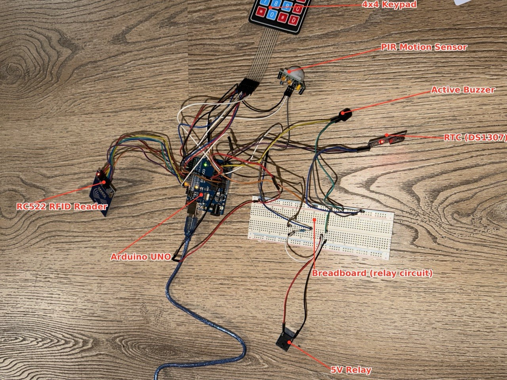
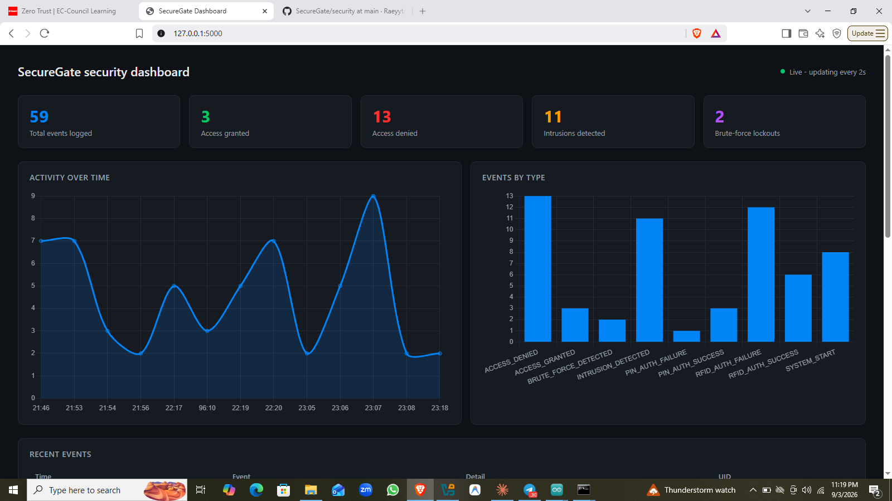

# SecureGate

A physical access-control and intrusion-detection system built on Arduino. Two-factor authentication (RFID + PIN), real-time motion detection, and a live security dashboard  perfect for a portfolio or hands on learning.



---

## Features

- **Two-Factor Authentication:** RFID card scan + numeric PIN required for access
- **Brute-Force Protection:** 3-strike lockout with 30-second cooldown
- **Motion Detection:** Independent PIR sensor continuously monitors for unauthorized presence
- **Timestamped Logging:** Every event recorded with RTC-provided accuracy
- **Live Dashboard:** Real-time visualization of security events with activity timeline and event breakdown
- **Structured Data Pipeline:** Arduino → JSON → Python collector → Flask dashboard
- **Security Documentation:** Threat model, attack scenarios, detection rules, and incident response runbook

---

## Quick Start

### Hardware
- Arduino UNO
- RC522 RFID reader + card
- 4x4 membrane keypad
- HC-SR501 PIR motion sensor
- 5V relay + transistor driver circuit
- DS1307 RTC module
- Active buzzer

### Software
```bash
# Install Python dependencies
pip install pyserial flask

# Terminal 1: Start the log collector
python python/log_collector/securegate_collector.py

# Terminal 2: Start the live dashboard
python python/dashboard/securegate_dashboard.py

# Open browser to http://127.0.0.1:5000
```

For detailed setup, see **[Setup Guide](documentation/setup.md)**.

---

## Architecture

### Hardware Flow
```
RFID Reader → Arduino UNO → Buzzer & Relay
Keypad    ↗               ↘ RTC (timestamps)
PIR Sensor ↗
```

### Data Pipeline
```
Arduino (JSON events)
    ↓ (USB serial, 9600 baud)
Python Collector (parses JSON)
    ↓ (appends to log file)
securegate_log.jsonl
    ↓ (Flask reads on demand)
Live Dashboard (auto-refreshes every 2s)
```

---

## Directory Structure

```
SecureGate/
├── arduino/
│   ├── rfid_test/           # RFID reader test sketch
│   └── securegate/          # Main SecureGate sketch (Stage 9)
├── python/
│   ├── log_collector/       # Serial listener + JSON parser
│   └── dashboard/           # Flask-based live dashboard
├── security/
│   ├── threat-model.md      # Asset protection, threat actors, in/out of scope
│   ├── attack-scenarios.md  # Concrete attack walkthroughs
│   ├── detection-rules.md   # Event types and alerting logic (SOC-style)
│   └── incident-response.md # Operational runbook for when rules fire
├── documentation/
│   ├── setup.md             # Arduino + Python installation
│   ├── wiring.md            # Pin assignments and connection guide
│   └── testing.md           # Test cases with expected behavior
├── images/                  # Hardware photos, architecture diagrams, dashboard screenshots
└── README.md                # This file
```

---

## Documentation

Start here based on what you need:

- **[Setup Guide](documentation/setup.md)** — Install hardware and software, get running in 10 minutes
- **[Wiring Guide](documentation/wiring.md)** — Detailed pin assignments and breadboard layout
- **[Testing Guide](documentation/testing.md)** — Test cases to verify each feature works
- **[Threat Model](security/threat-model.md)** — What SecureGate protects against (and what it doesn't)
- **[Attack Scenarios](security/attack-scenarios.md)** — Real-world attack walkthroughs
- **[Detection Rules](security/detection-rules.md)** — The actual alerting logic, SOC-style
- **[Incident Response](security/incident-response.md)** — How to respond when something fires

---

## How It Works

1. **User scans their RFID card** at the reader (10 seconds to respond)
2. **System validates the UID** against an allowlist; logs `RFID_AUTH_SUCCESS` or `RFID_AUTH_FAILURE`
3. **If UID matches:** Keypad prompts for PIN
4. **User enters PIN and presses `#`** to submit (or `*` to clear)
5. **System validates the PIN** (default: "1234"); logs `PIN_AUTH_SUCCESS` or `PIN_AUTH_FAILURE`
6. **If PIN is correct:**
   - Relay energizes for 2 seconds (simulated door unlock)
   - Buzzer beeps (audible confirmation)
   - `ACCESS_GRANTED` logged
7. **If either UID or PIN fails:** `ACCESS_DENIED` logged, short beep sounds
8. **After 3 consecutive failures:** System enters 30-second lockout; buzzer sounds once per second; all input ignored
9. **PIR motion detection runs independently** throughout — logs `INTRUSION_DETECTED` any time motion is sensed, even during authentication

**All events are timestamped (via DS1307 RTC) and logged to `securegate_log.jsonl`** in JSON format, which the Python collector reads and the Flask dashboard visualizes.

---

## Dashboard

The live dashboard (`http://127.0.0.1:5000` by default) shows:
- **Summary cards:** Total events, access granted/denied, intrusions, lockouts
- **Activity timeline:** Events per minute over the last 15 minutes
- **Event breakdown:** Bar chart of event counts by type
- **Recent events table:** The 25 most recent events with color-coded badges

The dashboard auto-refreshes every 2 seconds and stays current as long as the collector script is running.



---

## Security & Limitations

**In scope (fully implemented):**
- Two-factor authentication (RFID + PIN)
- Brute-force resistance (3-strike lockout)
- Independent motion-based intrusion detection
- Structured, timestamped event logging
- Clear threat modeling and documentation

**Out of scope (documented gaps):**
- Cryptographic card authentication (uses basic UID allowlist only)
- Log tampering resistance (not signed or write-once)
- Physical hardening (breadboard can be rewired)
- Network security (USB/serial only — no network exposure in this build)

See **[Threat Model](security/threat-model.md)** for detailed discussion of what is and isn't protected.

---

## Project Structure & Staged Build

This project was built and documented in 12 stages:

1. **Stages 1–8:** Arduino hardware (RFID, PIN, lockout, PIR, buzzer, relay, RTC, JSON logging)
2. **Stage 9:** JSON-formatted event output (ready for machine parsing)
3. **Stage 10:** Python log collector (reads Arduino events, saves to JSON Lines file)
4. **Stage 11:** Real-time Flask dashboard (visualizes events live)
5. **Stage 12:** Documentation & portfolio packaging (you are here)

Each stage builds on the previous one — the sketch and Python scripts are self-contained and can be run independently once wired.

---

## Skills Demonstrated

- **Embedded Systems:** Arduino programming, sensor integration, hardware wiring
- **Hardware Design:** Circuit design (transistor driver, relay control), pin management
- **Data Pipelines:** Serial communication, JSON parsing, log aggregation
- **Web Development:** Flask, real-time data fetching, interactive dashboards
- **Security Engineering:** Threat modeling, attack scenario analysis, incident response procedures
- **Portfolio & Documentation:** Clear README, architecture diagrams, runbook-style guides

---

## Getting Started

1. **Clone or fork this repo**
2. **Read [Setup Guide](documentation/setup.md)** for hardware and software installation
3. **Follow [Wiring Guide](documentation/wiring.md)** to connect components to the Arduino
4. **Run [Testing Guide](documentation/testing.md)** to verify everything works
5. **Explore the security documentation** to understand the threat model and detection logic

Questions? Check the troubleshooting section in [Testing Guide](documentation/testing.md) or review [Wiring Guide](documentation/wiring.md) for pin assignments.

---

## License

This project is open source and available for educational and portfolio use. Feel free to fork, modify, and learn from it.

---

## Next Steps

For an advanced version, consider:
- Upgrading to ESP32 for Wi-Fi + MQTT + cloud logging
- Adding a web-based credential management UI (manage enrolled cards without reflashing)
- Implementing log signing/encryption for forensic evidence integrity
- Integrating with Wazuh or another SIEM for centralized monitoring
- Adding IR camera feed or additional sensors

---

**Read the security docs to understand what's protected (and what's not).**

